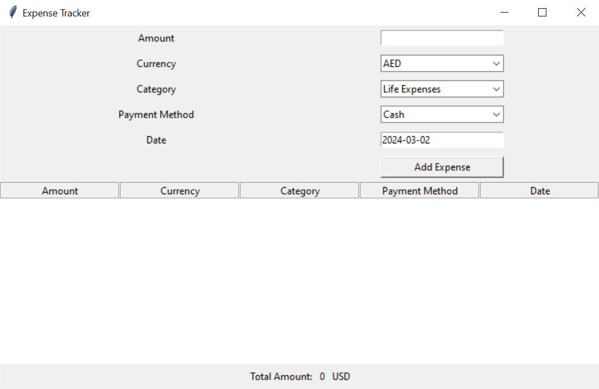

# 💰 Expense Tracker GUI Application 💼

## 🚀 Introduction

This Python script provides a user-friendly interface for tracking expenses, with features like real-time currency conversion, intuitive expense entry, and a sleek display of entered data. It was developed as a final project for the Almdrasa Python course.

## 🔑 Key Features

- **Expense Entry:** Easily input your expenses, including amount, currency, category, payment method, and date.
- **Currency Conversion:** Seamlessly convert expenses to a base currency (USD) using real-time exchange rates.
- **Data Display:** View all entered expenses in a tabular format, making it simple to track and manage your spending.
- **Total Amount Calculation:** Automatically calculates and displays the total amount of expenses entered, providing an instant overview of your spending.

## 🛠️ Dependencies

- **Tkinter:** Python's standard GUI library for creating graphical user interfaces.
- **requests:** A Python HTTP library used to make API requests for fetching currency data and performing conversions.
- **datetime:** A Python module for handling date inputs and manipulations.

## 🌐 API Integration

The application integrates with the Apilayer API for fetching currency data and performing conversions. Your API key is securely stored in a separate file ('APILayer_API_Key.env') for authentication.

## 📝 Usage Instructions

1. Ensure that the 'APILayer_API_Key.env' file containing the API key is present in the same directory as the script.

2. Run the script `expense-tracker.py` using the following command in your terminal or command prompt:

```bash
python expense-tracker.py
```

3. Enter details for each expense, including amount, currency, category, payment method, and date, then click on the "Add Expense" button to record the expense.

4. View all entered expenses and the total amount in the displayed table.

5. The application handles errors gracefully, displaying appropriate error messages in case of invalid inputs or failed API requests.

## 🖼️ Screenshot



## ✍️ Author

Created by Mahmoud Khalil
